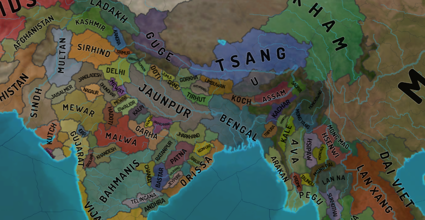

# eu4-svg-map
Svg maps generated out of eu4 configs with oikoumene.

Download the map and open from local file in either Chrome or Firefox. If you open the link directly, github will block font and background texture loading. Note that the two browser will render maps differently.
* <a href="https://raw.githubusercontent.com/primislas/eu4-svg-map/49c741c04850f28b645940a8af6c445b81bfb3aa/maps/mercator-political-1.30.0.svg" download>mercator-political.svg</a>
