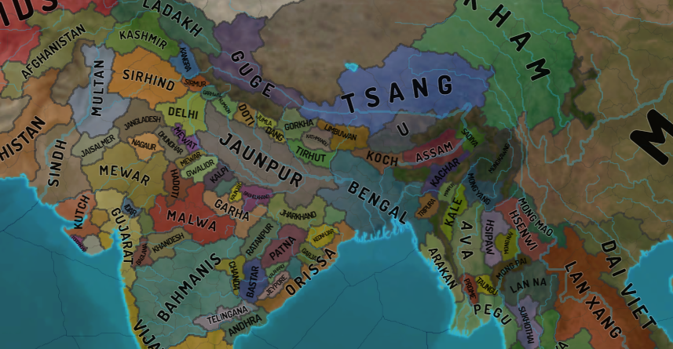
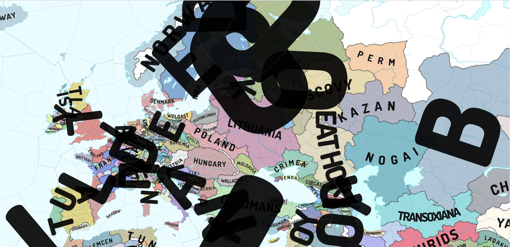

# eu4-svg-map
EU4 svg maps generated out of eu4 configs with [oikoumene](https://github.com/primislas/oikoumene).

Download the map ([right click and save as](https://raw.githubusercontent.com/primislas/eu4-svg-map/49c741c04850f28b645940a8af6c445b81bfb3aa/maps/mercator-political-1.30.0.svg")) 
and open from local file in either Chrome or Firefox. 
If you open the link directly, github will block font and background texture loading. 
Note that the two browsers will render maps differently. Further, note
that other svg readers would normally [fail](docs/pages/svg-rendering.md)
to render names correctly.
* <a href="https://raw.githubusercontent.com/primislas/eu4-svg-map/49c741c04850f28b645940a8af6c445b81bfb3aa/maps/mercator-political-1.30.0.svg" download>mercator-political.svg</a>

Globe projections can be view directly from github. Chrome and Firefox rendering is identical.
Svg doesn't give us real 3D, but trigonometry allows us to imagine what if.
This is why we need a real globe, Paradox! ;)
* [europe](https://raw.githubusercontent.com/primislas/eu4-svg-map/master/maps/globe-europe.svg)
* [africa](https://raw.githubusercontent.com/primislas/eu4-svg-map/master/maps/globe-africa.svg)
* [mid-east](https://raw.githubusercontent.com/primislas/eu4-svg-map/master/maps/globe-mid-east.svg)
* [indian-ocean](https://raw.githubusercontent.com/primislas/eu4-svg-map/master/maps/globe-indian-ocean.svg)
* [china](https://raw.githubusercontent.com/primislas/eu4-svg-map/master/maps/globe-china.svg)
* [south-america](https://raw.githubusercontent.com/primislas/eu4-svg-map/master/maps/globe-america-south.svg)
* [north-atlantic](https://raw.githubusercontent.com/primislas/eu4-svg-map/69ff5e1d843b103f4dee002518a1c3d5355f8087/maps/globe-atlantic-north.svg)
* [others](maps)

Algorithm description:
* [Province tracing](docs/pages/province-tracing.md)
* [Border parsing](docs/pages/border-parsing.md)
* [River parsing](docs/pages/river-parsing.md)
* [Name placement](docs/pages/name-placement.md)
* [Map with svg characteristics](docs/pages/svg-rendering.md)

Don't miss the [bloopers](bloopers). Developing is fun,
sometimes names hit the fan. :)

Contacts: primislas@protonmail.com
