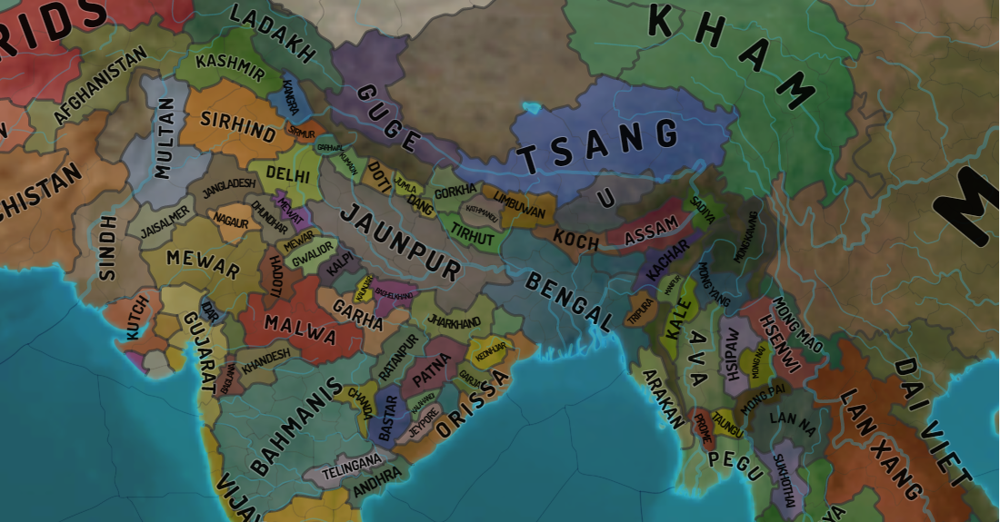
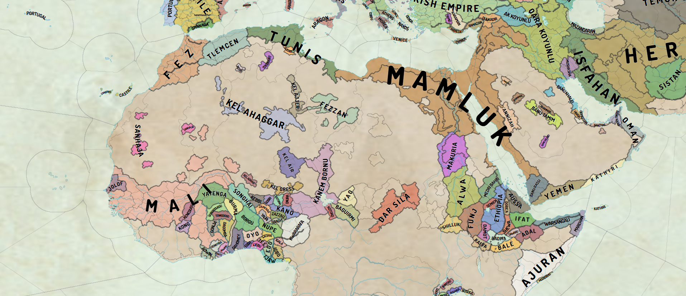

# eu4-svg-map
EU4 svg maps generated out of eu4 configs with [oikoumene](https://github.com/primislas/oikoumene).
Generate your own maps for mods and from saves, build province outlines, rasterize svg. Convert metadata
and store saves as json. [Manual](https://github.com/primislas/oikoumene/blob/master/docs/pages/tools.md).

Download the map ([right click and save as](https://raw.githubusercontent.com/primislas/eu4-svg-map/master/maps/1.30.0/eu4-political.svg)) 
and open from local file in either Chrome or Firefox. 
If you open the link directly, github will block font and background texture loading. 
Note that the two browsers will render maps differently. Further, note
that other svg readers would normally [fail](docs/pages/svg-rendering.md)
to render names correctly.
* <a href="https://raw.githubusercontent.com/primislas/eu4-svg-map/master/maps/1.30.0/eu4-political.svg" download>eu4-political.svg</a>
* <a href="https://raw.githubusercontent.com/primislas/eu4-svg-map/master/maps/1.30.0/eu4-province-outline.svg" download>eu4-province-outline.svg</a>

See also
* [svg style editing tips](docs/pages/svg-style.md)
* [svg to image](docs/pages/svg-rasterization.md)

Possible [mod](docs/images/mod-support.png) and [save](docs/images/save-and-wastelands.png) support, 
wasteland ownership. Save and view  
<a href="https://raw.githubusercontent.com/primislas/eu4-svg-map/master/maps/meiou/eu4-meiou-political.svg" download>MEIOU svg map</a>
by right-clicking and running save as.

Globe projections can be view directly from github. Chrome and Firefox rendering is identical.
Svg doesn't give us real 3D, but trigonometry allows us to imagine what if.
This is why we need a real globe, Paradox! ;)
* [europe](https://raw.githubusercontent.com/primislas/eu4-svg-map/master/maps/globe/globe-europe.svg)
* [africa](https://raw.githubusercontent.com/primislas/eu4-svg-map/master/maps/globe/globe-africa.svg)
* [mid-east](https://raw.githubusercontent.com/primislas/eu4-svg-map/master/maps/globe/globe-mid-east.svg)
* [indian-ocean](https://raw.githubusercontent.com/primislas/eu4-svg-map/master/maps/globe/globe-indian-ocean.svg)
* [china](https://raw.githubusercontent.com/primislas/eu4-svg-map/master/maps/globe/globe-china.svg)
* [south-america](https://raw.githubusercontent.com/primislas/eu4-svg-map/master/maps/globe/globe-america-south.svg)
* [north-atlantic](https://raw.githubusercontent.com/primislas/eu4-svg-map/69ff5e1d843b103f4dee002518a1c3d5355f8087/maps/globe/globe-atlantic-north.svg)
* [others](maps/globe)

Algorithm description:
* [Province tracing](docs/pages/province-tracing.md)
* [Border parsing](docs/pages/border-parsing.md)
* [River parsing](docs/pages/river-parsing.md)
* [Name placement](docs/pages/name-placement.md)
* [Map with svg characteristics](docs/pages/svg-rendering.md)

See Also:
* [Style samples](docs/pages/style-samples.md) - a collection of map style samples and resources 
I've come across and enjoyed.
* Don't miss the [bloopers](bloopers). Developing is fun,
sometimes names hit the fan. :)

Contacts: primislas@protonmail.com
