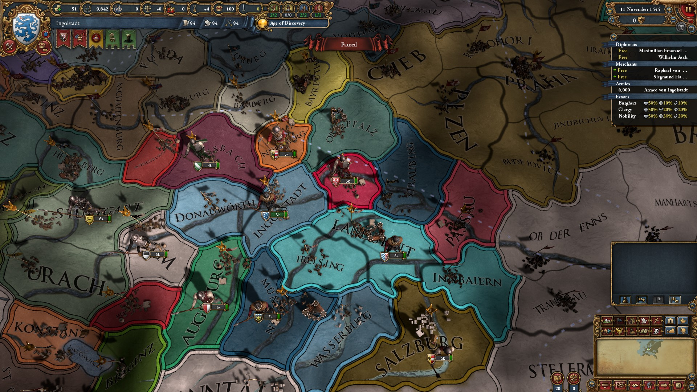

## Borders

Border rendering styles differ depending on the relation between
each two bordering provinces: is it a country border, an area border,
a simple border, a shoreline, etc. What this means in practice is that
it's not enough for the border tracer to identify the general shape
(province) border polyline. The latter needs to be split into
border segments, where each segment is a border between two 
and only two provinces.

Oikoumene [tracer](province-tracing.md) achieves this by marking 
border neighbors as it walks a shape's border. If you walk a shape 
clockwise, your right neighbor is always the same - the shape you're walking. 
Whereas your left neighbor could change. Track this, and you'll get 
necessary border segments.

Further, note that in the end you'll get segment duplicates - the
same segment will be repeated as you walk both neighbors. Depending
on the rendering engine and/or border type it might be prudent
to eliminate certain duplicates. In EU4's case this probably does not happen.
Consider the image below: to produce different country colors on 
both sides of a country border, clearly both border segments need
to be preserved to then be styled accordingly:

The image also neatly illustrates that eu4 too has individual
border segments - you can see them overlap
each other.

Another important thing Clausewitz does is smoothing the borders,
converting polylines with sharp angles into nice smooth curves.
Oikoumene has is using [Schneider's algorithm](border-smoothing.md)
to achieve this.
