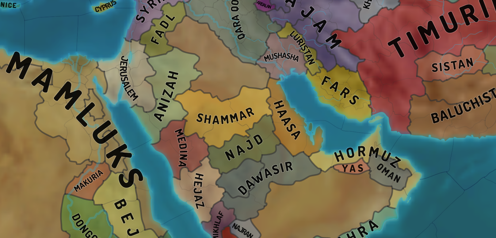
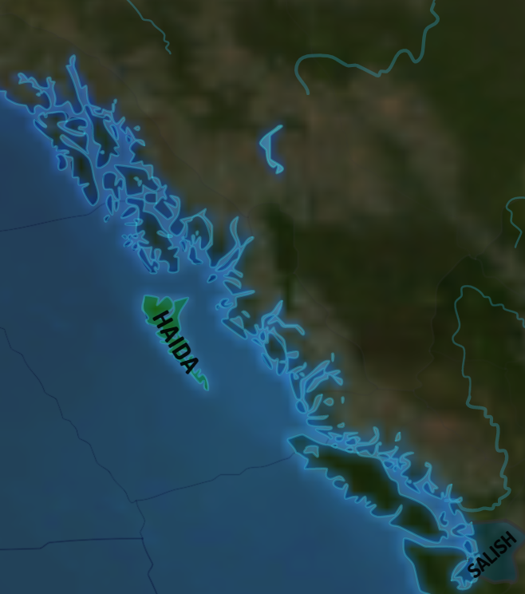
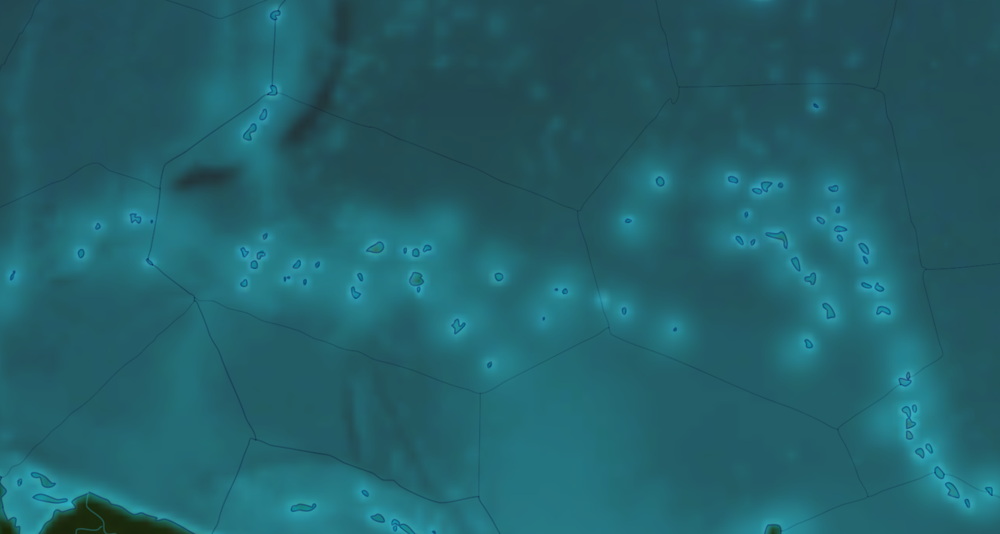
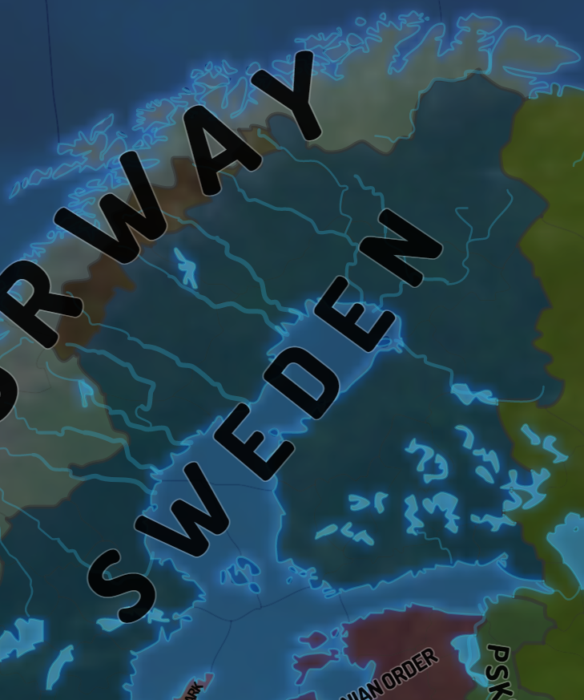

## Borders Smoothing

Broadly speaking, this is a curve fitting, approximation problem.
We've discovered that **Schneider's algorithm** produces very good results
while being computationally lightweight. The general approach is
to split borders [into individual border segments between two provinces](border-parsing.md)
and rivers into individual river segments based on their style
(defining river thickness in Clausewitz case), and then approximate each
such polyline with Schneider's algorithm.

Implementation has been translated from Victoria Rudakova's cpp implementation:
[Victoria's algorithm article](https://vicrucann.github.io/tutorials/curve-fitting-c++/), 
[github page](https://github.com/vicrucann/CurveFitting). All the default settings were good
(epsilon of 1E-6, Wu-Barsky coefficient of 3.0) with the exception of error. We were 
satisfied with the value of 1.5 (pixels) for Clausewitz. Increasing the value further could
mangle a lot of smaller map elements, but make it even more lightweight.

Honourable mention goes to 
[Ramer-Douglas-Peucker algorithm](https://en.wikipedia.org/wiki/Ramer%E2%80%93Douglas%E2%80%93Peucker_algorithm),
which is a good way of simplifying a polyline.

* Smooth border curves

* Complex shoreline of Alaska

* Tiny scattered Pacific islands

* Fjords and lakes of Scandinavia

