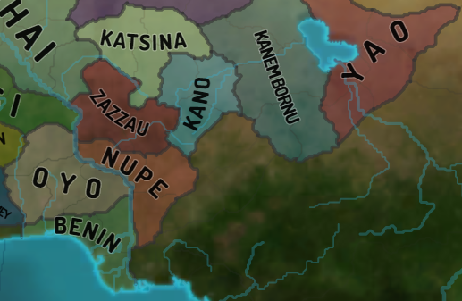

# Dynamic Map Generation

1. [Source bmp tracing](#tracer)
2. [Borders](#borders)
3. [Rivers](#rivers)
4. [Name placement](#name-placement)

## Source BMP and Province Tracing

One of the most widely used approaches to build a dynamic map
is to represent it with a bmp province file, where each province
has a unique color that can be used to identify other province
configs. A few things are required to be able to actually
render these shapes:
* trace shape borders to represent them as a polyline (basic level)
* certain provinces consist of multiple shapes (think a broken shore line
or a chain of small islands), this needs to be taken into account
* certain shapes contain inner shapes inside them belonging to different
provinces; tracer must be able to identify them as well
* depending on rendering engine, inner shapes need to be clipped out
from enclosing shapes

A simple approach to take care of all of the above is to: 
1. Assign each pixel in the bmp to a group (id), where a group is a collection
of pixels with the same color that border each other. Which makes
a province a collection of such pixel groups. Oikoumene's first
bmp pass does exactly that.
1. Then the tracer can simply go through the bmp file line by line, 
pixel by pixel, and trace any new group that isn't already traced.
I.e. once you discover a pixel that belongs to an untraced group (shape),
you trace it, mark the group id as traced, and keep going further. 
Single pass covers all shapes.
1. The above also takes care of inner shapes. You run no risk of
missing or losing them. 
1. Oikoumene traces a shape by 'walking' its border clockwise
pixel by pixel until it returns to the starting pixel. This means
that the walker can identify the next direction and pixel.
1. The tracer also should take care to identify neighbors of the shape
it is walking. See the borders section below.
1. The tricky part afterwards is to identify which shapes are "inner"
or "enclosed" shapes.
    * Naive but simple approach would be to identify
shapes that have only a single neighbor - in that case the neighbor
is clearly the enclosing shape. However, in practice a group of 
shapes can be enclosed by a large province, which means the naive
approach could (and will even in base eu4) fail.
    * Instead you should identify potential enclosed candidates during
    the first grouping pass (step 1) - if you go through a horizontal
    pixel line and discover that a group of pixels belonging to the same
    shape repeats after a "gap" of other shapes - that is a clear
    enclosing candidate, which should later be investigated by looking
    at "inner" candidates borders.

## Borders

Border rendering styles differ depending on the relations between
each two bordering provinces: is it a country border, an area border,
a simple border, a shoreline, etc. What this means in practice is that
its not enough for the border tracer to identify the general shape
(province) border polyline. The latter needs to be split into
border segments, where each segment is a border between two provinces.

Oikoumene tracer achieves this by marking border neigbors as it walks
a shape's border. If you walk a shape clockwise, your right neighbor
is always the same - the shape you're walking. Whereas your left
neighbor could change. Track this, and you'll get necessary border segments.

Further note that in the end you'll get segment duplicates - the
same segment will be repeated as you walk both neighbors. Depending
on the rendering engine and/or border type it might be prudent
to eliminate certain duplicates. In EU4's case this probably does not happen.
Consider the image below: to produce different country colors on 
both sides of a country border, clearly both border segments need
to be preserved to then be styled accordingly:

The image also neatly illustrates that eu4 too has individual
border segments - you can see them overlap
each other.

Another important thing Clausewitz does is smoothing the borders,
converting polylines with sharp angles into nice smooth curves.
Oikoumene hasn't cracked this part. Yet. :) In theory it should be
some kind of a quick and cheap spline (?) algorithm. However note
that certain borders are very complex, e.g. very broken shorelines
of Norway and Greenland. And the algorithm should be able to take
care of those as well.

## Rivers

River modding section on eu4 wiki sufficiently describes river configs.
The important take-aways for parsing purposes are:
* Rivers can consist of multiple branches and segments:
they can merge, split, have different width configured for the same river
along its flow.
* Oikoumene's river tracer represent rivers as a group of segments,
where a segment is a group of pixels belonging to the same river
and having the same width.
* Each individual river section in rivers.bmp is guaranteed to have
a "starting" point, from which we can begin tracing. Be it a river
source, flow-in or flow-out.
    1. On the first bmp pass identify these starting points.
    1. Trace sections that start from sources. If you're tracking direction,
    these flow along the line of tracing. Mark pixels as already traced,
    you'll need it later for tributary tracing.
    1. Then you can trace flow-ins and flow-outs. As there're at least 2
    river sections adjacent to 'tributary start' pixel, this is where
    you identify which one to take by discarding already traced pixels from
    previous step. 
    1. Note that for flow-ins you'll have to reverse final direction.
    (Depending on rendering engine, reversing river pixel list could suffice.)
    1. Note that flow-outs could have multiple tributaries start from
    the same source pixel.
    1. Don't forget to connect your tributaries / flow-outs to
    the main river.
* Further, it seems that Clausewitz can dynamically identify
"river crossing" types of borders from the map. This has not yet
been investigated by the oikoumene team.
* Further, it seems that Clausewitz can dynamically identify
estuaries? Also not yet investigated.
* As with borders, Clausewitz applies some sort of polyline smoothing
curve conversion to rivers.

## Name Placement

#### Requirements

* Names lie on a parabolic path. A good reason for limiting
curvature to parabola is that names lying on more complex curves
simply aren't very readable. Additionally, parabolas suffice for
the vast majority of names to look nice.
* Names should be placed geometrically centrally. The practical
consequence is that you can't use, say, province centers to approximate
the name curve, as provinces are not evenly distributed. It is
mandatory to identify the general border of a shape that you are naming.
Since countries are groups of provinces, it means that you need
to identify country shape / country borders for name placement.
* Clausewitz allows names to "leave" the shape and be written over 
wastelands and water, but not other countries or uncolonized provinces.

#### Notes on algorithm

* Polynomial curve fitting for a degree of 2 does the tricks,
most languages should have libraries readily available for it.
* Note that curve fitting algorithms (least squares in most cases)
work along provided x and y axes. Which means that we can only get
a classical or an upside down parabola. These can't represent
"vertical" names very well.
* As a consequence of the above, we should first identify shape's
spatial orientation - the line or the angle that will serve
as the x axis for our fitting.
* Since we're looking for a geometrically central nameline, it
seems reasonable to collect points, that are central vertically
with a certain horizontal step. Calculate them along the line / axis
identified in the previous step.
* Apply fitting algorithm to collected points. The line is ready.
* The next important step is identifying font size and placement
depending on available space. This is highly dependent on available space.
For smaller shapes where space is tight font pixelsize might become
significant in relation to available pixel length. There're no
general algorithms here, fit according to requirements, style guides, etc.
* A few general notes:
    * usually it becomes necessary to reduce font size for larger names
    * short names (up to 5 letters) normally don't look well when letters
    are too far apart
    * there's a peculiar case of "long thin shapes", where available
    "long" line might prompt you to assign font size that in reality
    is too big, because the shape is "thin"; these cases should be accounted for
    * if you're doing weighted curve fitting (and you should!), weigh
    "thinner" sections more, that will make your names "dive" into
    thin areas better
 

#### Oikoumene's implementation

1. Identify groups of neighboring provinces belonging to the same tag.
For each province group do the following.
1. Identify common shape border. Since province tracer gives us
individual border segments, we can assemble single coutry border
out of appropriate segments.
1. If we were to take all the border points for fitting, we would get
results that can be skewed and highjacked by complex and ridged borders,
because these tend to have a lot more points. Additionally, this approach
would be susceptible to various otherwise insignificant border curves.
For example, consider the English South-West

1. To account for all of that, we build an approximate convex
outer border representation with more or less evenly spaced out
points. Specifically, for each (step = 5) x we'll put two points
that represent min and max border points in this range.
We'll put one (average) point at left and right (by x) edges.
We'll do the same for y. The result is not strictly speaking optimal,
but it's a quick and simple algorithm that yields sufficiently good results.
1. Now we can identify orientation based off produced approximate border.
In practice, we don't need an exact angle for good fitting. Significant
deviations are allowed. Perhaps even up to 30 degree range. Having considered this,
we propose to identify orientation by drawing lines through the shape's
centroid with a 15 degree step starting from 0 and ending at 165 degress.
Best fitting orientation is the line that is closest to all the border points.
1. Now we can build an approximate name polyline respective to
identified orientation line. It is a collection of points that 
are y average for each x section (oikoumene uses a step of 5).
Remember to weigh them inversely respective to shape thickness
at a current step. The thinner the shape, the more weight.
That way names would curve towards thin sections better,
which is generally what we want.
1. Remember to track general thickness to later account for 
"long thin shapes" (cases like Orissa).

1. The polyline can be approximated with any
polynomial curve fitting implementation.

The image below illustrates all the steps: approximated border,
centroid, orientation line, name polyline, name parabola, name.
 

#### Deficiencies, further enhancements and alternatives

The algorithm has reached its limit in its current oikoumene
implementation. It has a number of deficiencies that require
qualitative improvements rather the tweaking at the edges,
as the latter now usually improves placement for certain shapes
while making it worse for others.
1. It is necessary to discard insignificant sections. E.g. oftentimes
"thin" sections at border edges are simply a result of there being
too few pixels, but they can skew name placement considerably,
especially for smaller shapes.
1. The algorithm doesn't handle very complex and tentacled shapes well.
Bordergore = namegore.
1. The algorithm in its raw form doesn't prevent names from going
over other countries. Blocking this, while allowing water and wastelands
requires a qualitative algorithm improvement.
1. The algorithm in its raw form can't handle concavity at shape's
left and right edges. For example, Ajam or in the most extreme case
Yarkand. Learning to identify and deal with these cases 
is the next qualitative step of algorithm enhancement.

1. Horseshoe shapes do not always produce a result you'd expect.
Identifying these kinds of shapes could be aesthetic microtweak.
Consider Nupe, Benin and the aforementioned Yarkand. It seems
reasonable to expect a horseshoe-like name for these, no?
Could be just me though. :)

One major alternative to be considered is fitting not to
a parabola but to an ellipse. An ellipse would account for quite
a few of the deficiencies mentioned above. However, it could also
be an impractically resource-hungry algorithm.
