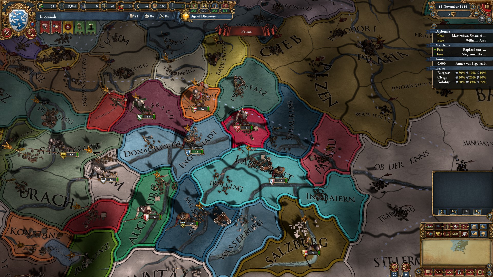

# Dynamic Map Generation

1. [Source bmp tracing](#tracer)
2. [Borders](#borders)
3. [Rivers](#rivers)
4. [Name placement](#name-placement)

## Source BMP and Tracing

One of the most widely used approaches to build a dynamic map
is to represent it with a bmp province file, where each province
has a unique color that can be used to identify other province
configs. A few things are required to be able to actually
render these shapes:
* trace shape borders to represent them as a polyline (basic level)
* certain provinces consist of multiple shapes (think a broken shore line
or a chain of small islands), this needs to be taken into account
* certain shapes contain inner shapes inside them belonging to different
provinces; tracer must be able to identify them as well
* depending on rendering engine, inner shapes need to be clipped out
from enclosing shapes

A simple approach to take care of all of the above is to: 
1. Assign each pixel in the bmp to a group (id), where a group is a collection
of pixels with the same color that border each other. Which makes
a province a collection of such pixel groups. Oikoumene's first
bmp pass does exactly that.
1. Then the tracer can simply go through the bmp file line by line, 
pixel by pixel, and trace any new group that isn't already traced.
I.e. once you discover a pixel that belongs to an untraced group (shape),
you trace it, mark the group id as traced, and keep going further. 
Single pass covers all shapes.
1. The above also takes care of inner shapes. You run no risk of
missing or losing them. 
1. Oikoumene traces a shape by 'walking' its border clockwise
pixel by pixel until it returns to the starting pixel. This means
that the walker can identify the next direction and pixel.
1. The tracer also should take care to identify neighbors of the shape
it is walking. See the borders section below.
1. The tricky part afterwards is to identify which shapes are "inner"
or "enclosed" shapes.
    * Naive but simple approach would be to identify
shapes that have only a single neighbor - in that case the neighbor
is clearly the enclosing shape. However, in practice a group of 
shapes can be enclosed by a large province, which means the naive
approach could (and will even in base eu4) fail.
    * Instead you should identify potential enclosed candidates during
    the first grouping pass (step 1) - if you go through a horizontal
    pixel line and discover that a group of pixels belonging to the same
    shape repeats after a "gap" of other shapes - that is a clear
    enclosing candidate, which should later be investigated by looking
    at "inner" candidates borders.

## Borders

Border rendering styles differ depending on the relations between
each two bordering provinces: is it a country border, an area border,
a simple border, a shoreline, etc. What this means in practice is that
its not enough for the border tracer to identify the general shape
(province) border polyline. The latter needs to be split into
border segments, where each segment is a border between two provinces.

Oikoumene tracer achieves this by marking border neigbors as it walks
a shape's border. If you walk a shape clockwise, your right neighbor
is always the same - the shape you're walking. Whereas your left
neighbor could change. Track this, and you'll get necessary border segments.

Further note that in the end you'll get segment duplicates - the
same segment will be repeated as you walk both neighbors. Depending
on the rendering engine and/or border type it might be prudent
to eliminate certain duplicates. In EU4's case this probably does not happen.
Consider the image below: to produce different country colors on 
both sides of a country border, clearly both border segments need
to be preserved to then be styled accordingly:

The image also neatly illustrates that eu4 too has individual
border segments - you can see them overlap
each other.

Another important thing Clausewitz does is smoothing the borders,
converting polylines with sharp angles into nice smooth curves.
Oikoumene hasn't cracked this part. Yet. :) In theory it should be
some kind of a quick and cheap spline (?) algorithm. However note
that certain borders are very complex, e.g. very broken shorelines
of Norway and Greenland. And the algorithm should be able to take
care of those as well.

## Rivers

## Name Placement
