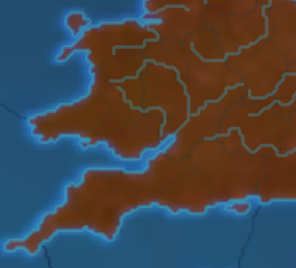
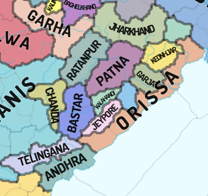
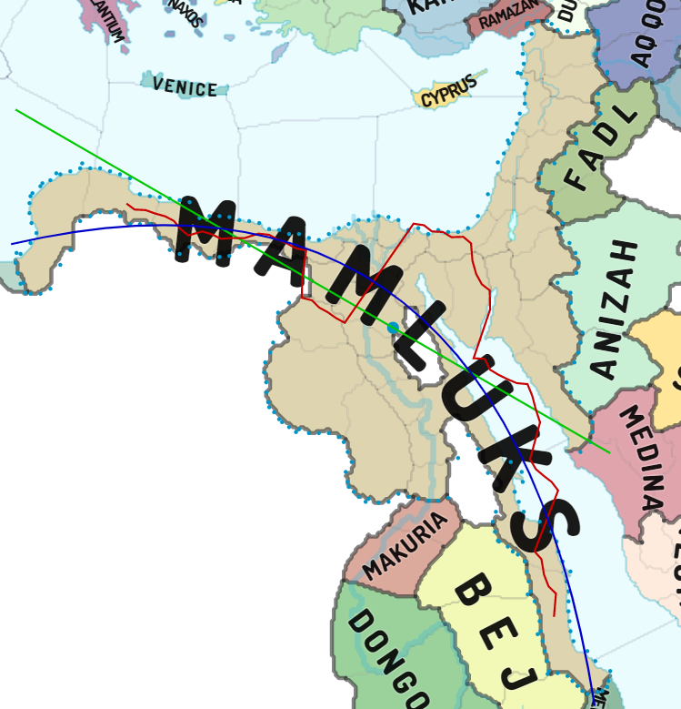
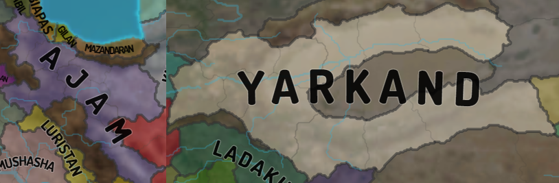
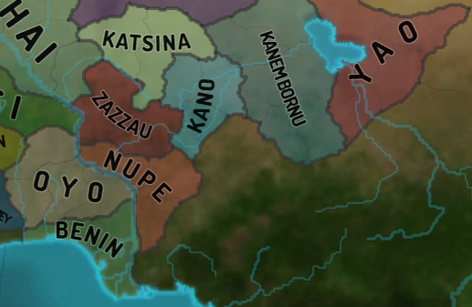

## Name Placement

#### Requirements

* Names lie on a parabolic path. A good reason for limiting
curvature to parabola is that names lying on more complex curves
simply aren't very readable. Additionally, parabolas suffice for
the vast majority of names to look nice.
* Names should be placed geometrically centrally. The practical
consequence is that you can't use, say, province centers to approximate
the name curve, as provinces are not evenly distributed. It is
mandatory to identify the general border of a shape that you are naming.
Since countries are groups of provinces, it means that you need
to identify country shape / country borders for name placement.
* Clausewitz allows names to "leave" the shape and be written over 
wastelands and water, but not other countries or uncolonized provinces.

#### Notes on algorithm

* Polynomial curve fitting for a degree of 2 does the tricks,
most languages should have libraries readily available for it.
* Note that curve fitting algorithms (least squares in most cases)
work along provided x and y axes. Which means that we can only get
a classical or an upside down parabola. These can't represent
"vertical" names very well.
* As a consequence of the above, we should first identify shape's
spatial orientation - the line or the angle that will serve
as the x-axis for our fitting.
* Since we're looking for a geometrically central nameline, it
seems reasonable to collect points, that are central vertically
with a certain horizontal step. Calculate them along the line / axis
identified in the previous step.
* Apply fitting algorithm to collected points. The line is ready.
* The next important step is identifying font size and placement
depending on available space. This is highly dependent on available space.
For smaller shapes where space is tight font pixelsize might become
significant in relation to available pixel length. There're no
general algorithms here, fit according to requirements, style guides, etc.
* A few general notes:
    * usually it becomes necessary to reduce font size for larger names
    * short names (up to 5 letters) normally don't look well when letters
    are too far apart
    * there's a peculiar case of "long thin shapes", where available
    "long" line might prompt you to assign font size that in reality
    is too big, because the shape is "thin"; these cases should be accounted for
    * if you're doing weighted curve fitting (and you should!), weigh
    "thinner" sections more, that will make your names "dive" into
    thin areas better
 

#### Oikoumene's implementation

1. Identify groups of neighboring provinces belonging to the same tag.
For each province group do the following.
1. Identify common shape border. Since province tracer gives us
individual border segments, we can assemble single country border
out of appropriate segments.
1. If we were to take all the border points for fitting, we would get
results that can be skewed and hijacked by complex and ridged borders,
because these tend to have a lot more points. Additionally, this approach
would be susceptible to various otherwise insignificant border curves.
For example, consider the English South-West

1. To account for all of that, we build an approximate convex
outer border representation with more or less evenly spaced out
points. Specifically, for each (step = 5) x we'll put two points
that represent min and max border points in this range.
We'll put one (average) point at left and right (by x) edges.
We'll do the same for y. The result is not strictly speaking optimal,
but it's a quick and simple algorithm that yields sufficiently good results.
1. Now we can identify orientation based off produced approximate border.
In practice, we don't need an exact angle for good fitting. Significant
deviations are allowed. Perhaps even up to 30 degree range. Having considered this,
we propose to identify orientation by drawing lines through the shape's
centroid with a 15 degree step starting from 0 and ending at 165 degress.
Best fitting orientation is the line that is closest to all the border points.
1. Now we can build an approximate name polyline respective to
identified orientation line. It is a collection of points that 
are y average for each x section (oikoumene uses a step of 5).
Remember to weigh them inversely respective to shape thickness
at a current step. The thinner the shape, the more weight.
That way names would curve towards thin sections better,
which is generally what we want.
1. Remember to track general thickness to later account for 
"long thin shapes" (cases like Orissa).

1. The polyline can be approximated with any
polynomial curve fitting implementation.

The image below illustrates all the steps: approximated border,
centroid, orientation line, name polyline, name parabola, name.
 

#### Deficiencies, further enhancements and alternatives

The algorithm has reached its limit in its current oikoumene
implementation. It has a number of deficiencies that require
qualitative improvements rather the tweaking at the edges,
as the latter now usually improves placement for certain shapes
while making it worse for others.
1. It is necessary to discard insignificant sections. E.g. oftentimes
"thin" sections at border edges are simply a result of there being
too few pixels, but they can skew name placement considerably,
especially for smaller shapes.
1. The algorithm doesn't handle very complex and tentacled shapes well.
Bordergore = namegore.
1. The algorithm in its raw form doesn't prevent names from going
over other countries. Blocking this, while allowing water and wastelands
requires a qualitative algorithm improvement.
1. The algorithm in its raw form can't handle concavity at shape's
left and right edges. For example, Ajam or in the most extreme case
Yarkand. Learning to identify and deal with these cases 
is the next qualitative step of algorithm enhancement.

1. Horseshoe shapes do not always produce a result you'd expect.
Identifying these kinds of shapes could be aesthetic microtweak.
Consider Nupe, Benin and the aforementioned Yarkand. It seems
reasonable to expect a horseshoe-like name for these, no?
Could be just me though. :)

One major alternative to be considered is fitting not to
a parabola but to an ellipse. An ellipse would account for quite
a few of the deficiencies mentioned above. However, it could also
be an impractically resource-hungry algorithm.
