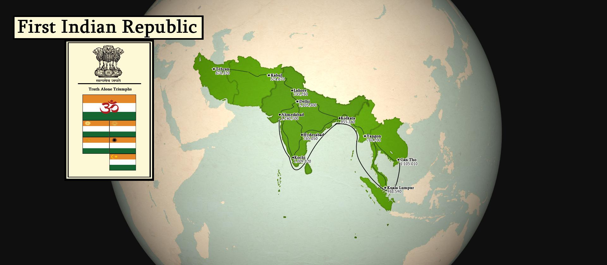
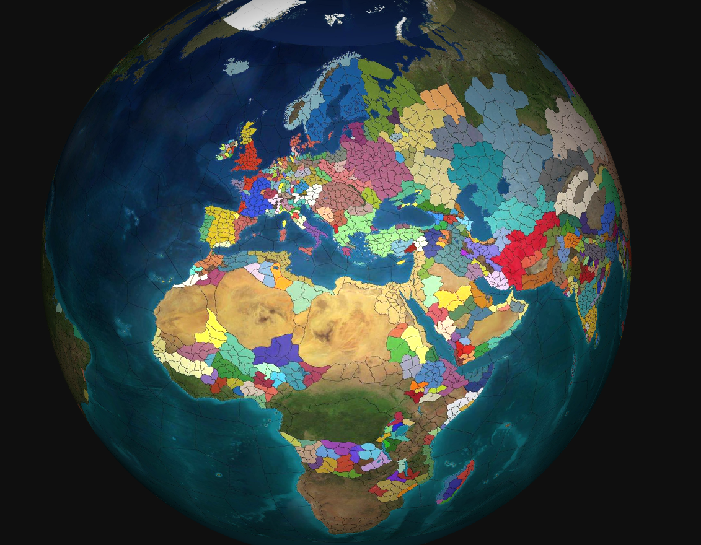

## Style Samples

Check out style [samples](../samples) attached to the project (links lead to origin pages):
* [Serene Republic of Italy](https://www.reddit.com/r/eu4/comments/hter01/)

* [First Indian Republic](https://www.reddit.com/r/eu4/comments/j5k6th/)

* [Globe with texture](https://www.reddit.com/r/eu4/comments/j5k6th/)

Interesting links and resources:
* [Atlas of Design](https://atlasofdesign.bigcartel.com/products) 
produced by North American Cartographic Information Society (NACIS).
* [Atlas Obscura](https://www.atlasobscura.com/articles/best-new-maps-2018)
has a few fancy maps in the linked article.
* [Caspian Report](https://www.youtube.com/user/CaspianReport) youtube channel,
that relies heavily on ArcGIS.
